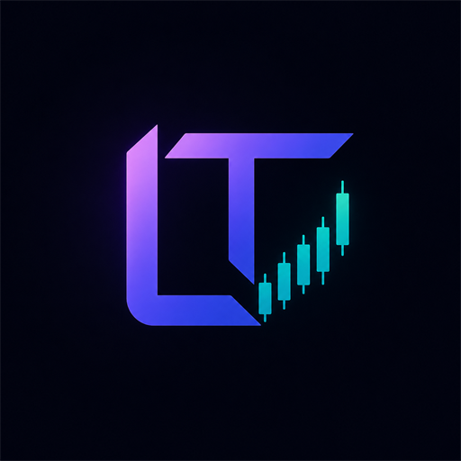

<p align="center">
  
</p>

<h1 align="center">Lyramor Trade Terminal</h1>

<p align="center">
  <strong>AI trading terminal untuk satu orang.</strong><br>
  Peluncur workspace yang menjalankan agent AI (Claude Code, Codex, opencode, pi) plus injeksi konteks trading — market data, analisis teknikal, berita, dan SDK broker — langsung ke dalam sesi agent lewat MCP.
</p>

<p align="center">
  <em>Versi 3</em>
</p>

---

## 1. Apa itu Lyramor Trade Terminal

**Lyramor Trade Terminal** adalah terminal trading berbasis AI yang berjalan
di mesin kamu sendiri. Dari sisi cara kerjanya, proses inti (Alice) melakukan
dua hal:

- **Peluncur Workspace (Workspace launcher)** — setiap workspace adalah sebuah
  direktori + repo git + sesi terminal persisten (PTY) yang menjalankan CLI
  agent AI pilihanmu: `claude` (Claude Code), `codex`, `opencode`, `pi`, atau
  `shell` biasa. Di dalam workspace itulah agent mengerjakan sebuah kapabilitas
  end-to-end: riset, iterasi kuantitatif, sampai eksekusi trading. Kapabilitas
  baru ditambahkan sebagai **template workspace** atau **satellite repo**, bukan
  sebagai kode baru di dalam `src/` — sehingga inti tetap ramping.

- **Injektor konteks trading (Trading-context injector)** — market data,
  analisis teknikal, berita, dan SDK broker (UTA) di-*surface*-kan ke dalam
  workspace tersebut lewat **MCP (Model Context Protocol)**. Jadi agent yang
  jalan di dalam terminal punya akses langsung ke tool trading, tanpa harus
  meninggalkan sesinya.

Kredensial broker dan seluruh state trading **tidak** ada di proses Alice — itu
hidup di proses terpisah bernama **UTA (Unified Trading Account)**. Alice yang
memutuskan (*deciding*); UTA yang mengeksekusi (*doing*). Keduanya bicara lewat
HTTP. Semua state persisten disimpan sebagai file — **tanpa database**.

Sekarang Lyramor Trade Terminal ada di **versi 3**.

---

## 2. Disclaimer & Kredit

> [!IMPORTANT]
> **Lyramor Trade Terminal dibangun di atas arsitektur [OpenAlice](https://github.com/TraderAlice/OpenAlice)** — sebuah proyek AI trading agent open-source (lisensi AGPL-3.0).
>
> Lyramor adalah **fork personal / rebrand** dari OpenAlice, bukan produk resmi
> dari tim OpenAlice. Seluruh fondasi arsitektur — split Alice ↔ UTA, mekanisme
> workspace, ToolCenter, Inbox, hingga MCP server — berasal dari OpenAlice, dan
> kredit penuh atas desain itu ada pada para kontributor OpenAlice. Yang
> ditambahkan di sisi Lyramor terutama adalah rebrand, transport chat UI khusus
> untuk Claude Code, launcher Windows (`run.ps1`), dan integrasi MCP tambahan
> (IDX/BEI dan TradingView).

> [!CAUTION]
> **Ini perangkat lunak eksperimental yang masih aktif dikembangkan.** Banyak
> fitur dan antarmuka belum lengkap dan bisa berubah sewaktu-waktu. Jangan
> pakai untuk live trading dengan dana sungguhan kecuali kamu benar-benar
> paham dan menerima risikonya. Tidak ada jaminan kebenaran, keandalan, atau
> profitabilitas, dan tidak ada tanggung jawab atas kerugian finansial.

---

## 3. Bisa Apa Aja (Fitur)

- **Chat dengan agent AI di dalam workspace** — ngobrol dengan agent lewat
  sesi terminal native (Claude Code, Codex, opencode, pi). Dapat prompt cache
  native, rendering native, tanpa lapisan protokol perantara.
- **Konteks trading otomatis** — tool trading, market data, analisis, dan
  berita di-inject ke dalam workspace lewat MCP, jadi agent bisa langsung
  meneliti dan bertindak tanpa keluar dari sesinya.
- **Market data lintas-aset** — ekuitas, kripto, komoditas, forex, dan data
  makro. Pencarian simbol lintas-aset yang terpadu.
- **Analisis teknikal & indikator** — kalkulator indikator, TA, dan sandbox
  perhitungan (`decimal.js` untuk matematika finansial).
- **Riset fundamental** — profil perusahaan, laporan keuangan, rasio, estimasi
  analis, kalender earnings, insider trading, ETF, hingga market movers.
- **Berita / RSS** — koleksi feed RSS di latar belakang plus pencarian arsip.
- **Data ekonomi makro** — FRED, EIA, BLS, FOMC, neraca Fed, indikator negara
  (CPI, suku bunga, ritel, harga rumah), volume pelabuhan/chokepoint, dsb.
- **Eksekusi trading via UTA** — arsitektur "Trading-as-Git": stage order,
  commit dengan pesan, lalu push untuk eksekusi; setiap trade punya riwayat
  lengkap dengan commit hash dan lolos *guard pipeline* (batas ukuran posisi,
  cooldown, whitelist simbol). Broker yang didukung: **Alpaca, CCXT
  (exchange kripto), Interactive Brokers (IBKR), Longbridge, dan mock** (untuk
  simulasi/testing).
- **Inbox push** — kanal push dari workspace ke user. Agent memanggil tool
  `inbox_push` untuk menampilkan dokumen (di-render live dari file workspace)
  plus komentar markdown di tab Inbox; user membalas untuk lompat kembali ke
  sesi workspace.
- **Automation / headless run** — sebuah workspace bisa mendeklarasikan jadwal
  sendiri (`.alice/issue.json`) atau dipicu lewat `POST /api/workspaces/:id/headless`,
  lalu jalan non-interaktif dan lapor balik lewat Inbox.
- **Multi-provider AI** — model berjalan di CLI agent native; bawa provider
  apa pun lewat *credential vault* (Anthropic, OpenAI, Google, GLM, MiniMax,
  Kimi, DeepSeek, …) atau pakai login langganan CLI-mu sendiri.

---

## 4. Teknologi

| Lapisan | Teknologi |
|---|---|
| Monorepo | **pnpm** workspaces + **Turborepo** |
| Bahasa | **TypeScript** (strict, ESM-only, target ES2023) |
| Runtime | **Node.js 22+** |
| Frontend | **React 19** + **Vite** + **Tailwind CSS v4** |
| Web server | **Hono** (+ `@hono/node-server`) |
| Validasi | **Zod** (config) + **TypeBox** (schema parameter tool) |
| Matematika finansial | **decimal.js** |
| Terminal UI | **xterm.js** (`@xterm/*`) |
| Chart | **lightweight-charts** + **Recharts** |
| Protokol AI/tool | **MCP** (`@modelcontextprotocol/sdk`) |
| Git bundel | **dugite** (git per-platform, lintas-platform tanpa git sistem) |
| PTY | **node-pty** |
| Desktop (opsional) | **Electron** (shell desktop terpisah) |
| Broker SDK | `@alpacahq/alpaca-trade-api`, `ccxt`, `@traderalice/ibkr`, `longbridge` |

Dua proses jangka-panjang yang disupervisi oleh **Guardian**:

- **Alice** (`src/`) — agent runtime, domain riset (market data, analisis,
  berita), peluncur workspace, dan semua permukaan UI. **Tidak** memegang
  kredensial broker.
- **UTA** (`services/uta/`) — *broker carrier*. Menyimpan koneksi broker, state
  trading model git, guards, FX, dan snapshot. Bind hanya ke `127.0.0.1`.
  Alice dan UTA berkomunikasi lewat paket bersama `@traderalice/uta-protocol`
  (satu-satunya bentuk data yang melintasi batas proses). UTA dirancang bisa
  dipisah ke perangkat lain (ala hardware-wallet) tanpa menulis ulang kedua sisi.

---

## 5. Nyambung ke Apa Aja / MCP

Lyramor menggunakan **MCP (Model Context Protocol)** untuk menyalurkan tool ke
agent. Ada empat MCP yang relevan — dan perhatikan ada **dua opsi TradingView
yang berbeda** (kontrol chart desktop vs. data publik):

| MCP | Nama / Port | Fungsi |
|---|---|---|
| **MCP bawaan Lyramor** | `open-alice` (global) & `open-alice-workspace` (per-workspace), port **47332** | Expose seluruh tool trading, market, analisis, berita, ekonomi, ekuitas, dll. ke agent di dalam workspace. Loopback-only, tanpa auth (konsumen hanya subproses lokal). |
| **IDX MCP** | port **4002** (SSE) | Data saham BEI (Bursa Efek Indonesia). Panduan: [`docs/idx-mcp.md`](docs/idx-mcp.md). |
| **TradingView MCP (CDP)** — `tv-mcp` | port **9333** (CDP) | Kontrol / otomasi **aplikasi TradingView Desktop** via Chrome DevTools Protocol. |
| **TradingView MCP (data publik)** — `tradingview-mcp-server` | Python / `uvx` | 37 tool market data + 30+ indikator TA + screener + backtest + sentimen. **Tanpa** akun / API key. Panduan: [`docs/tradingview-mcp.md`](docs/tradingview-mcp.md). |

### a) MCP bawaan Lyramor (`open-alice` / `open-alice-workspace`)

MCP server internal yang di-mount di `src/server/mcp.ts`. Setiap workspace
mendapat file `.mcp.json` yang menunjuk ke server ini, sehingga agent di dalam
terminal langsung melihat seluruh permukaan tool Lyramor. Grup tool yang
di-expose (dari `src/tool/`):

- **Trading** — `placeOrder`, `modifyOrder`, `cancelOrder`, `closePosition`,
  `tradingPush` / `tradingCommit` / `tradingReject` / `tradingSync` /
  `tradingStatus` / `tradingShow` / `tradingLog`, `getAccount`, `getPortfolio`,
  `getOrders`, `orderHistory`, `tradeHistory`, `listUTAs`.
- **Market** — `getQuote`, `marketSnapshot`, `marketGetBoard`, `searchBars`,
  `getMarketClock`, `listMarketVendors` / `setMarketVendor`,
  `marketSearchForResearch`, `indexSearch`, `sectorRotation`.
- **Analysis / Quant / Thinking** — `calculate`, `calculateQuant`, `simulate`,
  `simulatePriceChange`.
- **News** — `readRss`, `grepRss`, `globRss`, `windowRss`.
- **Economy** — `economyFredSeries` / `economyFredSearch` / `economyFredRegional`,
  `economyBlsSeries` / `economyBlsSearch`, `economyFomcDocuments`,
  `economyFedBalanceSheet`, `economyCountryCpi` / `economyCountryRates` / …,
  `economyEnergyOutlook`, `economyPetroleumStatus`, `economyPortVolume`, dll.
- **Equity / ETF / Derivatives** — `equityGetProfile`, `equityGetFinancials`,
  `equityGetRatios`, `equityGetEstimates`, `equityGetEarningsCalendar`,
  `equityGetInsiderTrading`, `equityGetShortInterest`, `equityDiscover`,
  `etfSearch` / `etfGetHoldings` / `etfGetSectors` / `etfGetInfo`,
  `cryptoFuturesInstruments`, `cryptoOptionsChains`, `getContractDetails`,
  `searchContracts`, `expandContract`.
- **Inbox / Entity** (workspace-scoped) — `inbox_push`, `inbox_read`,
  `workspace_path`, `entity_upsert`, `entity_search`.

### b) IDX MCP — data saham BEI (port 4002)

Sidecar terpisah di `~/idx-mcp-server`. Menyajikan ~8 tool saham BEI lewat SSE
di port 4002, membaca dari database IDX-API SQLite. Didaftarkan ke Claude Code
di **scope USER** (`~/.claude.json`), jadi **semua sesi claude** — termasuk yang
jalan di dalam workspace Lyramor — otomatis melihat tool-nya. Panduan lengkap
(termasuk koreksi atas empat kesalahan tutorial lama): [`docs/idx-mcp.md`](docs/idx-mcp.md).
Ringkasan setup juga ada di bagian [Setup IDX MCP](#7-cara-setup-idx-mcp).

### c) TradingView — dua opsi berbeda

Ada dua integrasi TradingView yang **saling melengkapi** dan bisa dipakai
bersamaan:

- **`tv-mcp` (CDP, port 9333)** — mengontrol / mengotomasi **aplikasi TradingView
  Desktop** lewat Chrome DevTools Protocol (buka simbol, ganti timeframe, baca
  kondisi chart yang sedang tampil). Butuh aplikasi desktop yang login. Lihat
  bagian [Setup TradingView MCP](#8-cara-setup-tradingview-mcp).
- **`tradingview-mcp-server` (data publik, Python/`uvx`)** — 37 tool market data,
  30+ indikator teknikal, screener global, backtesting (9 strategi +
  walk-forward), sentimen Reddit, dan berita finansial. **Tidak** login/scrape
  akun dan **tidak** butuh API key — murni data publik dari sisi server. Panduan:
  [`docs/tradingview-mcp.md`](docs/tradingview-mcp.md).

---

## 6. Cara Setup Project (dari Nol)

Ada dua cara: **(A) minta AI-mu yang setup** — paling cepat kalau kamu pakai
Claude Code atau agent MCP lain — atau **(B) manual** langkah demi langkah.

### 🤖 A. Sekali jalan — dipandu AI

Clone repo ini, buka foldernya dengan Claude Code (atau agent MCP lain), lalu
tempel prompt berikut. AI akan membaca `README.md` + folder `docs/` dan memasang
seluruh stack (project + IDX MCP + TradingView MCP) untukmu:

> Baca `README.md` dan folder `docs/` di repo ini, lalu setup lengkap **Lyramor
> Trade Terminal** di mesinku (Windows), langkah demi langkah, dan konfirmasi
> dulu kalau ada keputusan penting:
> 1. `pnpm install` lalu `pnpm build` di root repo.
> 2. Jalankan lewat `run.ps1`, pastikan UI hidup di `http://localhost:47331`.
> 3. Setup **IDX MCP** (data saham BEI) sesuai `docs/idx-mcp.md`: install Deno,
>    clone IDX-API, `deno task db:sync` lalu `deno run -A SyncMcp.ts`, jalankan
>    `sidecars/idx-mcp-server` (`npm install && npm start`), lalu daftarkan lewat
>    `claude mcp add idx-market-data http://localhost:4002/sse --transport sse`.
> 4. Setup **TradingView MCP data publik** sesuai `docs/tradingview-mcp.md`:
>    install `uv`, lalu daftarkan `tradingview-mcp-server` (pin `--python 3.13`).
> Kerjakan berurutan dan laporkan hasil tiap langkah.

Kalau lebih suka manual, ikuti langkah di bawah.

### B. Manual — Prasyarat

| Tool | Kenapa |
|---|---|
| **Node.js 22+** | Menjalankan backend |
| **pnpm 10+** | Package manager monorepo (`npm install -g pnpm`) |
| **git** | Clone repo |
| **Windows** | Launcher `run.ps1` ditujukan untuk Windows (PowerShell) |
| **Claude Code CLI** (opsional tapi disarankan) | CLI agent untuk workspace chat — jalankan `claude` sekali untuk login |

### Langkah

```powershell
# 1. Install dependency (dari root repo)
pnpm install

# 2. Build bundle produksi (UTA + Alice + UI)
pnpm build

# 3. Jalankan lewat launcher Windows (BUKAN `pnpm dev`)
powershell -ExecutionPolicy Bypass -File .\run.ps1
```

`run.ps1` menyalakan UTA (port 47333) lebih dulu, menunggu health-check-nya
lolos, lalu menjalankan Alice (agent runtime + UI) di foreground supaya kamu
bisa melihat log dan token admin. Ia juga otomatis menyalakan IDX MCP (port
4002) kalau terpasang.

> **Kenapa `run.ps1`, bukan `pnpm dev`?** Di Windows, menjalankan bundle
> terkompilasi dari `dist/` lebih cepat dan andal. Karena itu jalankan
> `pnpm build` dulu, dan ulangi `pnpm build` setiap kali menarik kode baru.

### Buka UI

Buka **http://localhost:47331** di browser. Pada run pertama, sebuah **token
admin** akan dicetak sekali di jendela PowerShell — salin dan tempel ke layar
login. Sesi bertahan 7 hari.

### Data

Seluruh state pengguna (config, workspaces, kredensial, log) tersimpan global di
**`~/.openalice`** (mis. `C:\Users\<kamu>\.openalice`). Ini satu store global
yang dipakai bersama semua checkout — konfigurasikan broker sekali saja. Sub
folder utama: `data/config/` (JSON + akun tersegel), `workspaces/`,
`sealing.key` (kunci enkripsi, disimpan di luar `data/`).

---

## 7. Cara Setup IDX MCP

Kode server MCP data saham BEI sudah **ikut ter-clone** di dalam repo ini di
**[`sidecars/idx-mcp-server/`](sidecars/idx-mcp-server/)** (lihat README di folder
itu). Ia mendengarkan di port **4002** (SSE).

1. **Install & jalankan:**

   ```bash
   cd sidecars/idx-mcp-server
   npm install
   npm start          # http://localhost:4002/sse
   ```

2. **Sumber data (eksternal)** — IDX MCP hanya *membaca* database SQLite milik
   proyek pihak ketiga **IDX-API ([NeaByteLab](https://github.com/NeaByteLab))**;
   database ini **tidak** dibundel di repo. Secara default server mencarinya di
   `~/idx-api/data/database.sqlite` (bisa diubah via env `IDX_DB_PATH`). Siapkan &
   perbarui datanya lewat IDX-API:

   ```powershell
   cd ~/idx-api
   deno task db:sync
   deno run -A SyncMcp.ts
   ```

3. **Registrasi ke Claude (scope USER)** — server didaftarkan di
   `~/.claude.json` pada **scope USER**, sehingga **setiap sesi claude** — termasuk
   yang berjalan di dalam workspace Lyramor — otomatis melihat tool-nya tanpa
   konfigurasi per-workspace.

`run.ps1` akan otomatis menyalakan IDX MCP kalau `~/idx-mcp-server\server.ts`
ada dan port 4002 belum terpakai; kalau tidak, langkah ini dilewati diam-diam
supaya tidak pernah memblokir Lyramor. Endpoint SSE-nya: `http://localhost:4002/sse`.

---

## 8. Cara Setup TradingView MCP

Ada **dua opsi** yang saling melengkapi (boleh dipakai bersamaan).

### Opsi A — `tv-mcp` (kontrol chart desktop, CDP 9333)

Otomasi chart TradingView berjalan lewat **`tv-mcp`** di `~/tv-mcp`, memakai
**CDP (Chrome DevTools Protocol) debug port 9333**.

- Dipakai untuk mengontrol / mengotomasi chart TradingView (buka simbol, ganti
  timeframe, baca kondisi chart) dari agent.
- Launcher `lyramor-trade.ps1` menyalakannya dengan:

  ```powershell
  cd ~/tv-mcp
  node src/cli/index.js launch --port 9333
  ```

- Kalau port 9333 sudah hidup atau `tv-mcp` tidak terpasang, langkah ini
  dilewati dan launcher tetap lanjut ke Lyramor. Setelah hidup, CDP tersedia di
  `http://localhost:9333`.

### Opsi B — `tradingview-mcp-server` (data publik, 37 tool)

Opsi kedua: 37 tool data publik (market data, 30+ indikator TA, screener,
backtesting 9 strategi + walk-forward, sentimen Reddit, berita) — **tanpa akun
maupun API key**, dan tidak menyentuh aplikasi TradingView. Butuh Python
**3.10–3.13** (BUKAN 3.14) dan `uv`/`uvx`.

```powershell
# 1. Install uv (penyedia uvx)
irm https://astral.sh/uv/install.ps1 | iex

# 2. Daftarkan ke Claude Code (scope USER) — pin Python 3.13 di Windows
claude mcp add tradingview -- uvx --python 3.13 --from tradingview-mcp-server tradingview-mcp
```

Panduan lengkap + troubleshooting (mis. error `-32001 Request timed out` di
first launch): [`docs/tradingview-mcp.md`](docs/tradingview-mcp.md).

---

## 9. Cara Bikin Shortcut "Lyramor Trade"

Launcher satu-klik `lyramor-trade.ps1` (simpan di folder mana saja di mesinmu,
misalnya `%USERPROFILE%\Scripts\`) merangkai empat langkah berurutan:

1. **Cloudflare WARP** — konek WARP untuk melewati blokir DNS ISP (broker,
   kripto, FRED bisa gagal tanpa ini).
2. **IDX MCP** — nyalakan data saham BEI di port **4002**.
3. **TradingView** — buka mode debug CDP di port **9333**.
4. **Lyramor** — jalankan `run.ps1` (UTA + Alice) di foreground, buka di
   **http://localhost:47331**.

> Langkah 1–3 opsional: kalau salah satu gagal, launcher tetap lanjut ke
> Lyramor.

### Membuat shortcut Windows (`.lnk`)

1. Klik kanan di Desktop → **New → Shortcut**.
2. Pada kolom lokasi, isi:

   ```
   powershell -NoProfile -ExecutionPolicy Bypass -File "<PATH-KE-SCRIPT>\lyramor-trade.ps1"
   ```

   Ganti `<PATH-KE-SCRIPT>` dengan folder tempat kamu menyimpan
   `lyramor-trade.ps1` (mis. `%USERPROFILE%\Scripts`).

3. Beri nama shortcut: **Lyramor Trade**.
4. Klik kanan shortcut → **Properties → Change Icon…**, arahkan ke ikon di dalam
   folder project:

   ```
   <FOLDER-LYRAMOR>\ui\public\lyramor.ico
   ```

   Ganti `<FOLDER-LYRAMOR>` dengan lokasi kamu meng-clone project ini.

Sekarang klik ganda shortcut "Lyramor Trade" untuk menyalakan seluruh stack
sekaligus.

---

## 10. Cara Dapat & Pasang API Key (Broker & Data Provider)

Lyramor butuh tiga jenis kredensial: **Broker** (buat eksekusi order lewat UTA),
**Data Provider** (buat data market/ekonomi), dan **AI Provider** (buat model
yang menjalankan agent CLI). Sebagian besar bisa dicoba tanpa key sama sekali.

> **Catatan penting sebelum mulai**
>
> - **Semua key disimpan di `~/.openalice` — di luar folder repo, tidak pernah
>   ke-commit / ke-push.** Kredensial broker & akun UTA di-**seal (enkripsi
>   AES)**; kunci `sealing.key` disimpan di samping folder `data/` (bukan di
>   dalamnya). Key data-provider disimpan **plaintext** di
>   `~/.openalice/provider-keys.json`.
> - **Broker: pakai akun paper/demo/testnet dulu.** Semua broker punya mode
>   paper/demo dengan key terpisah dari live. Jangan pernah menaruh key broker di
>   file yang ikut ke-commit ke git.
> - **Yang TIDAK butuh key sama sekali:** broker **`mock`/Simulator** (uji
>   coba tanpa uang), data provider **`federal_reserve`** (FRED keyless untuk
>   sebagian besar seri), dan **board bawaan lewat TradingHub** (aktif
>   otomatis — banyak board market/ekonomi jalan anonim tanpa key). Yang butuh
>   key: exchange kripto, Alpaca, Longbridge, `fred` (seri tertentu), `fmp`, dan
>   AI provider.

### a) Broker — eksekusi trading (via UTA)

Dipasang lewat UI **Settings → Broker / UTA account** (wizard "Add account").
Kredensial langsung di-seal ke `~/.openalice`, **tidak** masuk repo. Pilih mode
**paper/demo/testnet** dulu; key live dan key paper selalu terpisah.

| Provider | Untuk apa | Cara dapat key (link) | Cara pasang di Lyramor |
|---|---|---|---|
| **Alpaca** | Saham & ETF AS (fractional) | Bikin key di dashboard [alpaca.markets](https://alpaca.markets) — **Paper dan Live pakai key berbeda**, ambil dari dashboard yang sesuai | Settings → Broker → *Alpaca (US Equities)* → pilih mode Paper/Live → isi API Key + Secret |
| **CCXT — Binance** | Kripto spot + futures | API key + secret dari Binance. Paper = **Demo Trading**: bikin key khusus demo di [demo.binance.com](https://demo.binance.com) → API Management (key live ditolak di demo, dan sebaliknya) | Settings → Broker → *Binance* → mode Live/Demo → API Key + Secret |
| **CCXT — Bitget** | Kripto spot + perp USDT-M | Buat API key di dashboard **Bitget → API Management**, aktifkan izin **trade** (butuh API Key + Secret + **Passphrase** yang kamu set saat bikin key) | Settings → Broker → *Bitget* → mode Live/Demo → API Key + Secret + Passphrase |
| **CCXT — OKX** | Kripto spot/perp/opsi | API Key + Secret + **Passphrase** dari OKX. Demo butuh set key terpisah dari mode demo OKX | Settings → Broker → *OKX* → mode Live/Demo → API Key + Secret + Passphrase |
| **CCXT — Bybit** | Kripto spot/perp/opsi | API Key + Secret dari Bybit; Testnet & Demo masing-masing punya key sendiri | Settings → Broker → *Bybit* → pilih mode → API Key + Secret |
| **CCXT — exchange lain** | KuCoin, Gate, MEXC, dll. (100+ exchange CCXT) | API key + secret dari exchange masing-masing (baca [docs.ccxt.com](https://docs.ccxt.com) untuk field yang diperlukan) | Settings → Broker → *CCXT Custom* → isi Exchange ID + field kredensial |
| **Interactive Brokers (IBKR)** | Saham/opsi/futures/FX/bonds | **Bukan API key biasa** — auth lewat login TWS / IB Gateway lokal. Nyalakan *Enable ActiveX and Socket Clients* (File → Global Config → API). Port default 7497 (paper) / 7496 (live), Gateway 4002/4001 | Settings → Broker → *IBKR (TWS / IB Gateway)* → isi Host + Port + Client ID (tanpa key) |
| **Longbridge** | Saham HK / US / CN / SG | **appKey + appSecret + accessToken** dari [open.longbridge.com](https://open.longbridge.com). Access token tahan ~90 hari dan **tidak auto-refresh** — regenerate saat expired | Settings → Broker → *Longbridge* → mode Live/Paper → App Key + App Secret + Access Token |
| **Hyperliquid** | Perp DEX | **Bukan API key** — pakai tanda tangan wallet. Bikin *API wallet* khusus di [app.hyperliquid.xyz/API](https://app.hyperliquid.xyz/API), pakai private key-nya (jangan wallet utama) | Settings → Broker → *Hyperliquid* → Wallet Address + API Wallet Private Key |
| **`mock` / Simulator** | Uji coba tanpa uang | **Tanpa key sama sekali** | Settings → Broker → *Simulator (testing only)* → set starting cash |

### b) Data Provider — data market & ekonomi

Dipasang lewat **Settings (credential vault)** atau langsung mengedit file
`~/.openalice/provider-keys.json` dengan format `{ "namaProvider": "key" }`,
contoh:

```json
{ "fmp": "KEY_FMP_KAMU", "fred": "KEY_FRED_KAMU" }
```

> **TradingHub bawaan** (aktif default) sudah membuat banyak board market/ekonomi
> jalan **tanpa key** — key di bawah hanya perlu kalau kamu mau data yang keyed
> atau kuota lebih tinggi. Nama key persis mengikuti `credential-map.ts`.

| Provider | Untuk apa | Cara dapat key (link) | Cara pasang di Lyramor |
|---|---|---|---|
| **`fmp`** (Financial Modeling Prep) | Fundamental saham, rasio, financials | Daftar gratis di [financialmodelingprep.com](https://financialmodelingprep.com) (ada free tier) | `provider-keys.json`: `"fmp": "..."` atau Settings → credential vault |
| **`federal_reserve` (FRED)** | Data ekonomi makro AS | **Keyless** untuk sebagian besar seri (lewat TradingHub). Untuk akses langsung/kuota penuh, key gratis: | Jalan tanpa key; opsional pasang `"fred": "..."` |
| **`fred`** | Seri FRED tertentu yang butuh key | Key gratis di [fred.stlouisfed.org](https://fred.stlouisfed.org/docs/api/api_key.html) | `provider-keys.json`: `"fred": "..."` |
| **`eia`** | Data energi / minyak | Key gratis di [eia.gov/opendata](https://www.eia.gov/opendata/) | `provider-keys.json`: `"eia": "..."` |
| **`bls`** | Statistik tenaga kerja AS | Key gratis di [bls.gov/developers](https://www.bls.gov/developers/) | `provider-keys.json`: `"bls": "..."` |
| **`nasdaq` / `tradingeconomics` / `econdb` / `intrinio` / `benzinga` / `tiingo` / `biztoc`** | Data ekonomi/market/berita tambahan (opsional) | Ambil key dari situs masing-masing provider | `provider-keys.json` pakai nama key persis (mis. `"tiingo": "..."`) |
| **Marketaux** (opsional) | Berita & sentiment (dipakai di TradingView MCP) | Key gratis di [marketaux.com](https://www.marketaux.com) | Dipasang saat setup TradingView MCP (lihat bagian 8), bukan di credential vault Lyramor |

### c) AI Provider — model untuk agent CLI

Dipasang lewat **Settings → AI Provider** (credential vault, di-**seal** ke
`~/.openalice`). Satu key mencakup semua "wire shape" yang didukung provider itu.

| Provider | Untuk apa | Cara dapat key (link) | Cara pasang di Lyramor |
|---|---|---|---|
| **Anthropic (Claude)** | Model default agent (Opus/Sonnet) | API key di [console.anthropic.com](https://console.anthropic.com) — atau login langganan lewat `claude login` di terminal | Settings → AI Provider → *Claude (API Key)* → tempel key |
| **OpenAI** | Model GPT (via Codex) | API key di [platform.openai.com](https://platform.openai.com) — atau login ChatGPT lewat `codex login` | Settings → AI Provider → *OpenAI (API Key)* → tempel key |
| **Google Gemini** | Model Gemini | API key di [Google AI Studio](https://aistudio.google.com/app/apikey) | Settings → AI Provider → *Google Gemini* → tempel key |
| **MiniMax** | Model MiniMax (Anthropic-compatible) | Console China [minimaxi.com](https://www.minimaxi.com) / International [minimax.io](https://www.minimax.io) (key region-locked) | Settings → AI Provider → *MiniMax* → pilih region → tempel key |
| **GLM (Zhipu)** | Model GLM | Console China [bigmodel.cn](https://open.bigmodel.cn) / International [z.ai](https://z.ai) | Settings → AI Provider → *GLM* → pilih region → tempel key |
| **Kimi (Moonshot)** | Model Kimi | Console [platform.moonshot.cn](https://platform.moonshot.cn) / [platform.moonshot.ai](https://platform.moonshot.ai) | Settings → AI Provider → *Kimi* → pilih region → tempel key |
| **DeepSeek** | Model DeepSeek | API key di [platform.deepseek.com](https://platform.deepseek.com) | Settings → AI Provider → *DeepSeek* → tempel key |
| **Custom** | Endpoint / provider apa pun | Sesuai provider yang kamu pakai | Settings → AI Provider → *Custom* → isi backend, model, baseUrl, key |

---

## 11. Lisensi

Proyek **Lyramor** dirilis di bawah lisensi **AGPL-3.0** — lihat berkas
[`LICENSE`](./LICENSE) di root repositori untuk teks lengkapnya.

Karena dibangun di atas [OpenAlice](https://github.com/TraderAlice/OpenAlice)
(yang juga AGPL-3.0), ketentuan copyleft lisensi upstream tetap berlaku dan
harus dihormati.
